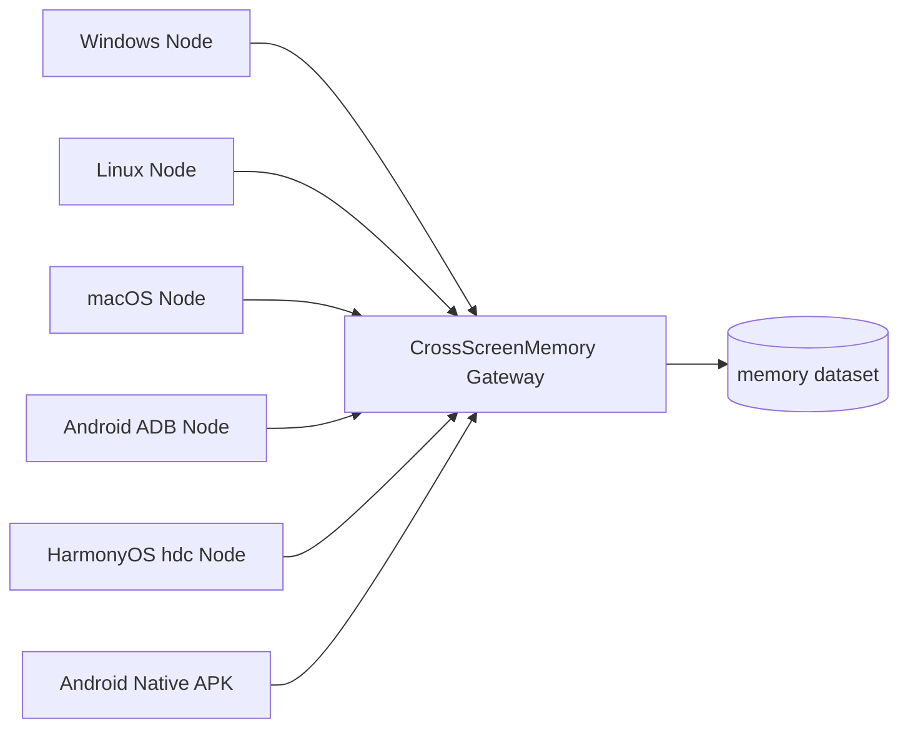
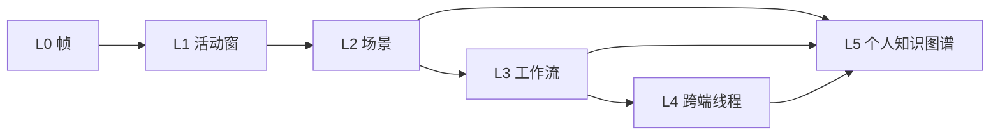
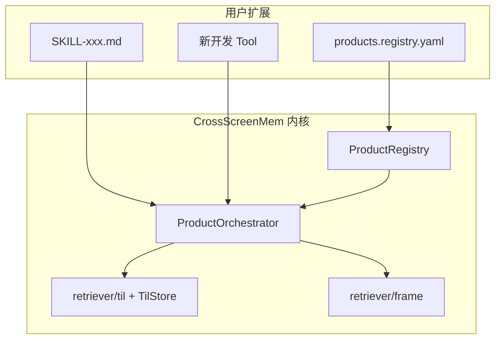

## 文档信息
- **文档ID**: DOC-OPS-RD-001
- **版本**: 1.0
- **作者**: Sheep同学-AI
- **维护人**: Sheep同学-AI
- **创建日期**: 2026-05-28
- **最后更新**: 2026-05-29
- **审批状态**: 审批中
- **批准人**: Sheep同学

---

# CrossScreenMemory 正式发布：让 AI Agent 拥有可信、可控、可复盘的跨屏记忆

在 AI Agent 正在成为个人工作入口的今天，一个越来越清晰的问题浮出水面：

> 如果 Agent 不了解你曾经看过什么、做过什么、在哪个设备上处理过什么任务，它就很难真正成为你的长期助手。

过去，Agent 的上下文大多来自对话窗口、用户手工粘贴的文件、浏览器历史或应用内部记录。它们要么覆盖范围太窄，要么依赖用户主动整理，要么无法跨设备联动。一个真实的工作日往往发生在多个屏幕之间：电脑上的 IDE、终端、浏览器、文档、会议窗口，手机上的聊天、网页、购物、通知、学习材料。用户真正需要的不是“保存更多截图”，而是能在需要时找回证据、理解上下文、复盘过程，并让 Agent 基于真实记忆回答问题。

今天，我们正式发布 **CrossScreenMemory**：面向 OpenClaw 生态的跨屏幕记忆基础设施。它将多设备屏幕活动转化为可检索、可总结、可治理、可复盘的个人数字记忆层，让 OpenClaw Agent 不再只依赖当前对话，而是可以调用用户自托管环境中的长期屏幕记忆。

---

## 一、为什么需要 CrossScreenMemory

### 1. 屏幕正在成为个人 AI 的新上下文入口

人类的数字生活并不只存在于聊天记录或文档文件中。大量关键决策发生在屏幕上：

- 开发者在网页文档、IDE、终端日志之间切换，定位 Bug、查 API、验证方案。
- 知识工作者在会议、飞书/Teams/Zoom、PPT、浏览器和协作文档中形成结论。
- 学生和上班族在手机、电脑、平板之间浏览课程、资料、商品和通知。
- 多设备用户常常先在手机上发现线索，再到电脑上继续整理和执行。

这些屏幕活动形成了非常有价值的“过程证据”。但传统系统只保存结果，不保存过程；只保存文件，不保存上下文；只保存单端历史，不理解跨端任务。

CrossScreenMemory 的目标，就是把屏幕上的重要文本证据组织成可以被 Agent 使用的长期记忆。

### 2. 市场已经证明方向成立，但仍缺少 Agent 原生记忆层

近几年，屏幕记忆方向已经出现多类产品和项目：

| 类型 | 代表方向 | 价值 | 局限 |
|---|---|---|---|
| 系统级闭源方案 | Microsoft Recall、Pixel Screenshots、Chronicle | 与系统深度集成，用户感知强 | 平台限制明显，可扩展性和信任边界受限 |
| 商业个人记忆产品 | Limitless、Memories.ai 等 | 可穿戴设备为主 | 开放生态有限，数据主权和自托管能力受限 |
| 开源本地优先项目 | Screenpipe、OpenRecall、OpenChronicle | 证明本地采集、索引、插件扩展可行 | 往往以单一平台为主，和 Agent 工具合同也并非原生一体 |
| 云端推理路线 | Chronicle 类视觉理解方案 | 模型理解能力强 | 截图出端，隐私、合规、成本压力更大 |

这些方向共同说明：屏幕记忆是 AI Agent 时代的重要基础设施。然而，现有方案都还存在一些共性问题：

- 跨设备数据孤岛：screenpipe跨平台但数据不跨设备；Chronicle/Recall/ScreenMemo锁定单一平台；各方案间数据格式不兼容。用户在手机、平板、PC、可穿戴设备上产生的记忆碎片无法统一检索，是整个领域尚未解决的系统性问题。
- 场景分析与重建能力较弱：现有方案采用持续截图+OCR的数据分析范式，本质上仍是“零散的屏幕截图集合”，系统没有对时间线内容进行场景类型的自动分割、智能标签的自动生成、或完整的任务流重构，缺乏真正的 “可管理的记忆知识单元”。难以回答跨长时间的问题。
- 主动性缺失：所有现有方案均为被动记录器，等待用户主动查询。没有任何方案能主动识别”你正在做的事情与三周前的某个会议决策相关”并推送提醒，或自动生成工作日报、识别重复性任务模式。这是从”记忆存储”到”认知增强”之间最大的功能鸿沟。
- 多模态理解深度不足：绝大多数方案将”理解”等同于”OCR”。屏幕上的图表、图片、UI状态、代码高亮、表格结构等视觉信息在OCR流水线中完全丢失。音频、长视频等媒体数据也没有被广泛采用。
- 开源生态集成不足：仅screenpipe外，Chronicle只集成CodeX且闭源，其余方案没有提供原生集成、REST API、MCP 服务、webhook 回调、CLI等完整的集成能力接口，难以与现有AI 编码助手、claw 智能助手、已有业务系统进行深度整合。
- 自定义扩展能力缺失：现有方案缺乏“可管理的记忆知识单元”，更缺乏对多粒度记忆单元的查询、总结、过滤等内置算子、可编排执行Tools/Skills，用户无法通过编排算子/Tools，快速扩展自定义场景。

但 CrossScreenMemory 选择的切入点不同。它不是再做一个独立截图时间线，而是把跨端屏幕记忆作为 **OpenClaw Agent 的原生工具层、检索层和时序理解层，支持用户零码实现定制功能**。

---

## 二、核心设计理念：不是截图仓库，而是可治理的记忆基础设施，赋能个人智能助手

CrossScreenMemory 的设计围绕五个原则展开。

### 1. 用户自托管，而不是默认云托管

CrossScreenMemory 默认运行在用户自己控制的 OpenClaw 网关环境中。多端 Node 将端侧处理后的文本与元数据通过 WebSocket 上报到网关，数据落在用户控制的状态目录中。这里的“本地优先”不是指每台设备各自孤立保存，而是指用户拥有自己的网关、自己的磁盘、自己的删除权和运维权，赋能个人智能助手。

### 2. 跨端汇聚，而不是单端孤岛

当前产品支持 6 类 Node 实现形态：`windows`、`linux`、`macos`、`android-PC`、`harmonyos`、`android-native`。其中 `android-native` 是 Android 原生 APK 形态。

这意味着，用户可以把桌面端、移动端、Android 原生端等不同来源的屏幕数据，通过统一协议汇聚到一个 CrossScreenMemory 网关中，再通过同一套 Store/Tool/Skill 进行检索、总结、复盘和治理。

### 3. 帧级权威数据，派生时序分层记忆

系统将原始帧级文本记忆作为 L0 权威源，存储在 `memory` 中。更高层的 TIL（Temporal Intelligence Layer）时序智能层只读 L0 并写入独立派生多粒度记忆数据，出现异常时可以关闭或重建，不破坏基础检索能力。

### 4. Agent grounding 优先

CrossScreenMemory 不鼓励 Agent “凭印象回答”。它要求先检索，再总结；没有结果就明确说明没有结果，严谨幻觉和胡编乱造。CrossScreenMemory 作为OpenClaw 原生集成的记忆组件，覆盖被动检索和主动服务，极大扩展了个人智能助手的能力边界。

### 5. 产品能力可自定义编排

在基础记忆和时序层之上，CrossScreenMemory 提供 PEF（Product Extension Framework）产品扩展框架。用户可以通过编写 Skill 和少量配置，把已有记忆能力编排成日报、会议包、购物比价、学习复盘等个性化功能。对于最轻量的扩展场景，用户甚至可以只写一个 Skill，不改 Plugin 代码。

---

## 三、关键特性与背后的关键技术

### 1. 多设备跨端屏幕记忆：覆盖桌面端与移动端

CrossScreenMemory 的第一层能力，是把不同设备上的屏幕元数据统一接入。



端侧 Node 负责采集、OCR、脱敏、构造 payload 和离线队列。
Gateway 负责注册、鉴权、Schema 校验、限流、幂等去重、入库和 ack。
这个设计把平台差异留在端侧 provider 中，把协议与网关处理保持统一。

关键技术包括：

- **WebSocket JSON 统一协议**：支持多端设备，将不同平台、终端的元数据统一成一套数据模型，并通过自动区分平台、设备、状态等。扩展新设备类型时，仅需要开发终端数据采集的provider。
- **JSON Schema 协议版本校验**：网关按 `protocolVersion` 选择对应 Schema版本，允许版本升级，避免错误平台或字段进入系统。
- **离线队列与 ack 对齐**：端侧断网后可继续积压，恢复连接后再同步。
- **网关幂等校验**：通过 `contentHash` 和 `dedupeKey` 避免重复上传污染记忆库。

### 2. 时序分层记忆存储（TIL）：从 L0 到 L5 的多粒度记忆

单条屏幕文本只是“点”。真正的回忆需要“线”和“面”：一段阅读、一次会议、一组任务、跨设备的连续活动、长期出现的人和项目。

CrossScreenMemory 的 TIL（Temporal Intelligence Layer）将记忆分为 L0-L5：

| 层级 | 名称 | 作用 |
|---|---|---|
| L0 | 帧级记忆 | 每次端侧上传的屏幕元数据证据，是权威源 |
| L1 | 活动窗 | 将连续帧合并成阅读、编辑、浏览等活动单元 |
| L2 | 场景 | 将活动窗切分为可解释的时间段，并生成摘要等语义单元 |
| L3 | 工作流 | 将多个场景组织成会议、编码、研究、沟通、购物等任务模式 |
| L4 | 跨端线程 | 将不同设备上的相关活动连接成同一任务线 |
| L5 | 个人知识图谱 | 抽取长期实体、关系、主题和兴趣结构 |



关键技术包括：

- **异步派生**：TIL 不阻塞端侧上报和 L0 元数据落盘，终端先把事实证据写入 `memory`，L1-L5 再由后台队列近线生成，让采集链路和高级理解解耦。
- **横向分层索引 + 纵向区间替换**：L1 活动窗、L2 场景、L3 工作流、L4 跨端线程、L5 个人图谱共享同一套在线索引策略；支持每次重算只替换与目标时间窗相交的各层派生记忆，而不是清空整台设备或整库重建。
- **索引更新三件套架构**：`replaceInRange` 负责内存中记忆增量覆盖，`jsonlCompaction` 保持持久化文件长期可维护，`ensureDerived` 在历史查询前按需补齐缺失层级，使高频命中记忆留存内存中。
- **L3 自定义模板 + LLM 识别**：任务流先按内置模板识别会议、编码、调研、购物、娱乐等模式；所有内置模板均实现统一接口 `WorkflowTemplate`，用户通过配置 JSON/YAML，与内置模板 实现**同一接口**；即可实现自定义扩展模板，`hybrid` 模式再让 LLM 基于模板结果进一步总结场景摘要和修正场景类型。

```text
                ┌─────────────────────────────────────┐
                │     TilDerivedIndexPolicy (T3)      │
                │  （JsonlTilStore + TilDispatcher）   │
                └─────────────────────────────────────┘
                              │
           ┌────────────────┬────────────────┬────────────────┐
           ▼                ▼                ▼                │
    ① replaceInRange   ② jsonlCompaction   ③ ensureDerived   │
      (ingest 写入)      (后台/停机)         (list/query 前)    │
           │                │                │                │
           └────────────────┴────────────────┴────────────────┘
                              │
                    内存 Map（在线索引）
                              │
                    持久化数据库/文件（物理索引）
```

| 套件 | 职责 | 适用层级 |
|------|------|----------|
| **① 时间窗 replace** | 索引构建 / 索引重建时，仅删除内存中与 `[fromTime,toTime]` **有交集** 的记录，再更新本窗重算结果 | **L1–L4** |
| **② jsonl 压实** | 从内存往持久化写入时，`TilMaintenanceJob` 按 id 保留最新行，删除中间过程数据；**禁止** list/query 扫盘 jsonl | **L1–L4** |
| **③ ensureDerived** | 查询窗内有 L0 但派生不足时，入队与 ingest **同一串行队列** 做懒派生 | 按 Tool 所需 `stages` 含对应层 |


### 3. 与 OpenClaw 原生集成：插件化、工具化、Skill 化

CrossScreenMemory 不是一个外置脚本，而是 OpenClaw-native 的插件化能力模块。OpenClaw可以一条命令安装本项目，在启动OpenClaw网关时，自动调用插件入口 `register(api)`，插件在这里完成运行时装配：读取配置、创建 Gateway 服务、恢复本地状态、注册 Agent 可调用 Tool，并把屏幕记忆接入 OpenClaw 的记忆与模型生态。

这个原生集成由几部分组成：

- **入口注册**：插件入口负责创建或复用 `CrossScreenMemPlugin` 运行时实例，在完整运行模式下启动 WebSocket Gateway、ingest pipeline 和本地 store；在 discovery 模式下只暴露 Tool 元数据，避免启动重 IO。
- **Tool 注册**：所有 `cross_screen_mem_*` 能力都以 OpenClaw Tool 形式暴露，Agent 可以在对话中直接调用，而不需要理解底层设备协议、索引文件或派生队列。
- **Gateway RPC**：配对码颁发、运行状态查询、设备解绑等运维动作通过 Gateway 方法暴露，适合宿主、CLI 或管理界面调用，不混入面向 Agent 的日常 Tool。
- **Memory corpus supplement**：插件把 `cross-screen-memory` / `cross-screen-til` 作为 OpenClaw Memory 的补充语料源，使宿主的统一记忆搜索可以命中屏幕帧、场景和派生摘要。
- **可选 LLM bridge**：当 OpenClaw runtime 暴露模型能力时，插件会把 `agents.defaults.model` 等模型引用桥接给 TIL，用于场景摘要、任务流识别和结构化叙述；不可用时仍可回退到规则与模板逻辑。

从内部看，CrossScreenMemory 的调用链可以概括为 **配置 / ingest / storage / retriever / tools / skills** 六要素：

1. **配置** 决定采集频率、App 黑白名单、脱敏策略、TIL 开关、LLM modelRef 和派生保留策略。
2. **ingest** 接收各端 Node 上报的屏幕元数据，完成鉴权、归一化、去重、速率控制和 完成通知ACK，并异步触发 TIL 派生。
3. **storage** 以 `memory.jsonl` 保存 L0 权威帧级记忆，以 `til/*.jsonl` 和在线索引保存 L1-L5 派生结果，可选SQLite/索引用于加速或与原生openclaw-core配合。
4. **retriever** 负责混合检索、时间窗过滤、设备过滤、各层级检索、排序和下钻，把原始记忆或派生对象转成 Agent 可消费的命中结果。
5. **tools** 把这些能力封装为稳定 API，包括L0帧级五件套、TIL 层级 Tool 和产品层 Tool。
6. **skills** 在 Tool 之上编排具体场景，例如日报、会议复盘、购物比价和时间线回顾，让用户用自然语言触发复杂工作流。

基础五件套 Tool 是系统的稳定底座：

| Tool | 作用 |
|---|---|
| `cross_screen_mem_query` | 按关键词、时间、设备、应用等条件检索 L0 屏幕记忆，也可作为 TIL 结果为空时的帧级兜底。 |
| `cross_screen_mem_summary` | 基于已检索到的 `memoryIds` 拉取证据片段，并按用户指令生成摘要、要点或待办。 |
| `cross_screen_mem_list_devices` | 查看已配对设备、平台、在线状态和最近同步时间。 |
| `cross_screen_mem_delete` | 按记忆 ID、设备或时间范围删除记忆，并触发后续派生层引用清理。 |
| `cross_screen_mem_update_config` | 向指定 Node 下发采集配置变更；设备离线时进入待同步队列。 |

在 TIL 启用后，Agent 还可以调用 L1-L5 的层级 Tool，从“搜某一屏”升级为“理解一段时间内发生了什么”：

| TIL 层级 | 代表 Tool | 面向的问题 |
|---|---|---|
| **L1 活动窗** | `cross_screen_mem_get_activity_window` | 把连续滚动、阅读或编辑片段合并成可读窗口，回答“这段时间屏幕上主要出现了什么”。 |
| **L2 场景** | `cross_screen_mem_list_scenes`、`cross_screen_mem_get_scene` | 列出某个时间段内的会议、阅读、浏览、编辑等场景，并提供摘要、引用和源记忆。 |
| **L3 工作流** | `cross_screen_mem_list_workflows`、`cross_screen_mem_explain_workflow`、`cross_screen_mem_dismiss_workflow`、`cross_screen_mem_rename_workflow` | 识别跨场景任务线，例如编码、调研、购物、娱乐或沟通，并允许用户修正误识别结果。 |
| **L4 跨端线程** | `cross_screen_mem_query_threads`、`cross_screen_mem_confirm_thread_link` | 连接手机、电脑、平板等不同设备上的相关活动，回答“同一件事在哪些设备上连续发生”。 |
| **L5 个人知识图谱** | `cross_screen_mem_profile_query`、`cross_screen_mem_forget_entity` | 查询长期实体、主题、关系和偏好，并支持对特定实体执行遗忘。 |

在TIL 层级 Tool 之上，CrossScreenMemory 还提供产品层 Tools。它们不是新的 Lx 语义层级，而是把 L2-L4 的场景、工作流和跨端线程进一步编排成用户可以直接消费的成品：

| 产品层 Tool | 产品能力 | 使用场景 |
|---|---|---|
| `cross_screen_mem_get_daily_digest` | 生成指定自然日的每日活动日报，聚合当天场景、任务流、跨端线程、高亮与分段摘要。 | 用户问“今天做了什么”“昨天帮我复盘一下”“给我一份工作日报”时，Agent 可以先拿到结构化日报，再按需下钻到场景或工作流。 |
| `cross_screen_mem_get_meeting_pack` | 按 `meetingId` 或时间范围生成会议包，汇总会议类场景、摘要、证据句和相关上下文。 | 用户问“刚才会议讲了什么”“帮我整理 standup 纪要”“这次会议有哪些待办”时，Agent 可以直接基于会议包回答，必要时再读取具体场景证据。 |

Skill 是 CrossScreenMemory 面向 Agent 的“使用说明 + 路由策略 + Tool 编排合同”。每个 Skill 通过 front matter 声明 `name`、`displayName`、`description` 和 `requiredTools`，正文则规定何时加载、先调用哪个 Tool、空结果如何回退、哪些内容必须基于证据回答。这样，Plugin 负责提供稳定能力，Skill 负责把能力组织成符合用户意图的操作流程。

当前项目内置四个核心 Skills：

| Skill | 主要职责 | 典型流程 |
|---|---|---|
| `cross-screen-memory` | 帧级主 Skill，覆盖 L0 检索、总结、设备管理、删除和采集配置。 | 用户按关键词找某一屏时调用 `cross_screen_mem_query`；需要总结时先取得 `memoryIds` 再调用 `cross_screen_mem_summary`；删除或改配置前要求确认参数。 |
| `cross-screen-memory-temporal` | 时序层 Skill，覆盖活动窗、场景、工作流、跨端线程和个人知识图谱。 | 用户问“昨天下午做了什么”“这段时间项目进展如何”时，先按时间窗调用 `list_workflows` / `query_threads` / `list_scenes`，再用 `get_scene` 或 `get_activity_window` 下钻细节。 |
| `cross-screen-memory-daily-digest` | 每日活动日报 Skill，面向“今天/昨天做了什么”的自然日复盘。 | 先把用户时间表达换算成 `YYYY-MM-DD`，调用 `cross_screen_mem_get_daily_digest` 获取分段摘要和高亮；用户追问时再下钻到 scene 或 workflow。 |
| `cross-screen-memory-meeting` | 会议包 Skill，面向会议回顾、Standup 纪要和会议待办整理。 | 已知时间段或 `meetingId` 时调用 `cross_screen_mem_get_meeting_pack`，读取 `summary`、`keyQuotes` 和 `sceneIds`；追问细节时继续调用 `get_scene`。 |

这些 Skills 还承担路由边界：关键词复访优先 `cross-screen-memory`，时段回顾优先 `cross-screen-memory-temporal`，整天复盘优先 `cross-screen-memory-daily-digest`，会议复盘优先 `cross-screen-memory-meeting`。如果高层结果为空，Skill 会指导 Agent 逐级回退到场景、活动窗或帧级检索，并明确要求不得编造未被 Tool 返回的记忆内容。

这些高阶能力不是替代基础五件套，而是在同一套 OpenClaw 插件合同上逐层扩展：底层负责可信采集和检索，中层负责时间理解与跨端关联，上层组合成用户真正需要的产品体验。

### 4. PEF 编排框架：让用户用 Skill 扩展个性化能力

PEF（Product Extension Framework）的核心思想是：L0-L5 的采集、检索、派生和 Tool 已经存在，用户不应为了一个“周报”“学习复盘”“购物清单”就重新写一套 Plugin。PEF 把底层能力抽象为可编排的产品层，让用户优先通过 Skill 和 YAML 定义新产品，只有在需要强类型输出或复杂外部集成时才写少量 TypeScript，新增算子或者tools。



PEF 由几类概念组成：

| 概念 | 作用 | 关系 |
|---|---|---|
| `ProductRegistry` | 维护产品注册表，内置 `daily-digest` 和 `meeting-pack`，并可加载用户的 YAML / JSON registry。 | 告诉系统“有哪些产品、显示名是什么、对应哪个 Skill、有没有 pipeline”。 |
| `ProductDefinition` | 产品定义对象，声明 `id`、`displayName`、`skill`、可选 `tool`、`pipeline` 和 `outputSchema`。 | 是 registry 和 orchestrator 之间的合同。 |
| `ProductOrchestrator` | 解释产品定义中的 pipeline，按步骤调用 TIL、帧级检索和 compose 逻辑，生成产品结果。 | 负责把声明式 pipeline 变成实际执行链路。 |
| 内置算子 `op` | `list_scenes`、`get_scene`、`list_workflows`、`query_threads`、`query_frames`、`compose`。 | 每个 op 对应一个已有检索/派生能力，用户不需要直接操作 `TilStore`。 |
| 用户 YAML registry | 默认面向 `{workspace}/cross-screen-memory/products.registry.yaml`，也可通过 `products.userRegistryPath` 覆盖。 | 用低代码方式新增或覆盖产品定义。 |
| Skill 热加载 | Skill 本身由 OpenClaw 发现和加载；PEF registry 支持检测文件变更并重新加载。 | 让用户改 Skill 或 registry 后更快迭代产品体验。 |

这些概念之间的关系很简单：**Skill 负责告诉 Agent 怎么问、何时调用、如何回退；ProductRegistry 负责登记产品；ProductDefinition 描述产品流水线；ProductOrchestrator 读取定义并调用内置 op；op 再落到 TIL retriever、帧级 retriever 和已有 Tool 能力上。**

项目中的 `SKILL-shopping-compare.md` 就是一个轻量示例：用户曾在多个电商页面浏览同类商品，Agent 可以先通过 TIL 查找购物相关场景，再下钻到具体场景和活动窗，最后用 summary 对多个候选商品做结构化比价。整个过程可以只新增 Skill，不需要新增 Plugin Tool。

PEF 的扩展路径分为三档：

| 档位 | 用户需要做什么 | 效果与优点 |
|---|---|---|
| **L0 仅 Skill** | 只写 `SKILL-xxx.md`，声明 `requiredTools` 和操作流程。 | 零 TypeScript、改动最小，适合购物比价、阅读复盘、项目时间线等“复用已有 Tool 即可完成”的场景；由 OpenClaw 发现 Skill，Agent 按 Skill 规则编排调用。 |
| **L1 Skill + YAML registry** | 在 Skill 之外增加 `products.registry.yaml` / JSON，声明产品 id、显示名、Skill、pipeline 和输出形状。 | 不改插件代码即可登记产品和流水线；适合周报、学习复盘、固定时间窗分析等稳定产品变体；registry 可热加载，ProductOrchestrator 可解释内置 op。 |
| **L2 Skill + Tool + Builder** | 新增一个产品 Tool 和 `products/<id>/builder.ts`，必要时注册强类型 schema。 | 适合日报、会议包、外部 API 聚合、强 JSON 输出和需要缓存/复用的产品；优点是接口稳定、可测试、可作为正式产品能力发布。 |

本系统内置了两款产品， P1 / P2 展示了这三档如何落地：

| 产品 | L0 档：Skill 自动编排 | L1 档：Registry 自动登记 | L2 档：Tool + Builder 正式产品 |
|---|---|---|---|
| **P1 每日活动日报** | `cross-screen-memory-daily-digest` Skill 定义自然日换算、日报 Tool 调用、scene/workflow 下钻和帧级兜底。 | `ProductRegistry` 默认内置 `daily-digest`，绑定 `SKILL-daily-digest.md`；用户 registry 可继续声明类似周报、月报变体。 | `cross_screen_mem_get_daily_digest` 调用 `daily-digest/builder.ts`，基于 L2 场景、L3 工作流和 L4 线程生成结构化日报。 |
| **P2 会议包** | `cross-screen-memory-meeting` Skill 定义按时间范围或 `meetingId` 查询、读取 `keyQuotes`、追问时下钻 `get_scene`。 | `ProductRegistry` 默认内置 `meeting-pack`，绑定 `SKILL-meeting.md`；会议应用白名单由配置管理。 | `cross_screen_mem_get_meeting_pack` 调用 `meeting-pack/builder.ts`，筛选会议类场景并生成会议摘要、证据句和关联线程。 |

也就是说，当前 P1/P2 已经具备“用户直接用 Skill 触发”的 L0 体验和“系统自动登记产品元数据”的 L1 体验；同时它们还作为 L2 档内置产品，通过专用 Tool + builder 提供稳定接口。用户自定义产品可以从 L0 开始，成熟后升级为 L1 YAML pipeline，再在需要工程化交付时升级为 L2 Tool。

这让 CrossScreenMemory 不只是一个“记忆系统”，而是一个可以持续扩展的个人记忆产品平台。

### 5. 隐私安全：从采集、传输、存储到删除的全链路治理

屏幕记忆天然敏感，CrossScreenMemory 把隐私安全作为非谈判原则。

关键安全设计包括：

- **用户自托管环境**：默认数据落在用户控制的 OpenClaw 网关机器和本地 state 目录中，核心记忆文件、TIL 派生文件、产品缓存和配对表都由用户部署环境持有。CrossScreenMemory 不要求把屏幕记忆交给中心化云服务，后续即便增加 REST、MCP 或 CLI 适配层，也应保持“入口可替换、数据所有权不转移”的原则。
- **显式授权与启动确认**：Android Native 端已在启动采集前要求用户手动勾选确认同意，并通过系统 MediaProjection 授权弹窗获取屏幕采集权限；其他平台后续版本中补齐该能力。
- **端侧脱敏**：各端 Node 在上传前先完成 OCR、文本归一化和 `PrivacyFilter` 脱敏。当前跨平台规则集 `redact.v1` 会处理身份证号、手机号、银行卡号、邮箱和长 token 等高风险文本，并把 `rulesVersion` 写入 payload，便于后续审计和规则升级。用户也可以通过配置关闭或调整敏感过滤，但默认路径强调先脱敏、再入库。
- **App 黑白名单管控**：采集范围由 Node 配置控制，`appWhitelist` / `appBlacklist` 和采集间隔可以通过 `cross_screen_mem_update_config` 下发。这样用户可以排除银行、密码管理器、私聊、医疗等敏感应用，也可以只允许办公、浏览器、IDE 等特定场景进入记忆系统，从源头降低过度采集。
- **最小化上传内容**：当前默认上传 OCR 后文本、前台应用、窗口标题、时间、设备、哈希和必要元数据，不默认上传原始截图、视频或完整屏幕流。端侧用于 OCR 的像素数据不作为默认记忆内容进入 Gateway，`mediaRefs` 默认为空；如果未来支持多模态或截图证据，也应作为显式配置和独立权限处理。
- **设备配对码 + 会话密钥双重认证**：设备接入网关前，需要先通过一次性 `pairingSecret` 完成配对，配对码带 TTL 且消费后失效；随后网关给Node设备端颁发短期 `accessToken`，后续请求必须携带有效 token，否则无法完成数据上报。短期 `accessToken`过期后，必须重新获取配对码，来申请新的短期 `accessToken`。网关侧只在进程内维护在线态和令牌，持久化配对表只保存所有设备骨架，避免把会话凭证长期落盘。
- **幂等校验与限流**：每条上报都会携带 `dedupeKey`，Gateway 侧会基于 device、时间、应用、标题和内容哈希重新计算，防止客户端伪造幂等键污染索引；同一键重复上报只返回既有 `memoryId`，不重复写入索引。索引写入的`IngestPipeline` 还按设备维度做速率限制，异常批次可部分拒绝，避免故障 Node 或恶意客户端持续写入。
- **可删除、可解绑、可压实**：用户可以按 `memoryIds`、时间范围或设备删除指定记忆；解绑设备时不能只移除配对关系，还必须清理该设备相关的所有记忆。底层 JSONL 通过 tombstone 记录删除，再通过压实清除历史残留；TIL 层会裁剪派生记录中的源记忆引用，维护任务负责压实派生 JSONL、执行保留期裁剪，并让产品缓存随派生版本失效。
- **审计与日志最小化**：系统允许记录请求 id、batch id、deviceId、数量、耗时、错误码和 hash 前缀等运维信息，但不记录完整 `pairingSecret`、`accessToken`、原始 OCR content 或敏感截图路径。Tool 删除、ingest、配对和解绑等关键动作需要留下可排障的审计线索，同时避免把敏感正文写进日志。
- **LLM bridge 可降级**：TIL 摘要和任务流识别等环节可接入LLM能力，此时可以复用 OpenClaw runtime 暴露的模型能力，但模型桥接是适配层能力，不是 L0 采集链路的必须前置条件。宿主模型不可用时，系统会回退到规则和模板逻辑；启用外部模型时，应由部署环境明确模型、密钥和数据出站策略。

这些原则落实到内核模块中，形成了分层的隐私安全边界：

| 模块 | 隐私安全职责 |
|---|---|
| **设备端 Node runtime** | 执行采集间隔、App 黑白名单、内容变化检测、OCR 和端侧脱敏；离线时先写本地 outbox，收到 ACK反馈 后再清理本地待上传项。 |
| **Gateway / device** | 负责设备注册、一次性配对码、短期 `accessToken`、在线态、心跳和解绑；未认证连接不能写入记忆。 |
| **ingest pipeline** | 做 schema 校验、deviceId 绑定校验、`dedupeKey` 重算、设备级限流、幂等写入和批次 ACK反馈，避免脏数据进入 L0。 |
| **storage** | L0 权威源，删除采用 tombstone + compaction；SQLite 和内存索引只作为可重建加速层，不替代可治理的事实源。 |
| **retriever / tools** | 所有检索、总结、删除和配置下发都通过 Tool 合同暴露，查询范围受已配对设备、时间窗、App、deviceId 等参数约束；summary 必须基于 `memoryIds`，避免凭空生成、胡编乱造。 |
| **TIL / PEF** | 派生层只引用 L0 证据并保留 `sourceMemoryIds`；删除后会 prune 引用、压实派生文件、刷新产品缓存，日报和会议包不应绕过底层删除治理。 |
| **Skill 层** | Skill 明确要求“仅以 Tool 返回为据”，空结果时逐级回退并如实说明，不把模型猜测伪装成屏幕记忆。 |

---

## 四、用户体验官方案例

### 用户场景 1：想找回某次屏幕记忆的细节内容

用户问：

> “我昨天是不是看过一篇关于 SQLite FTS 的文档？在哪个窗口？”

Agent 可以调用 `cross_screen_mem_query`，限定时间范围和关键词，返回命中的记忆片段、应用、窗口标题、设备和时间。用户可以继续追问“帮我总结当时看到的重点”，Agent 再基于检索结果中的 `memoryIds` 调用 summary。

这个体验的关键是：回答不是模型猜测，而是来自真实屏幕记忆，数据来自原始元数据。

### 用户场景 2：时序层回顾一段时间在做什么

当用户的问题不是“某个词在哪一屏出现过”，而是“某段时间我在做什么”“这个项目最近推进到哪了”“手机和电脑是不是在处理同一件事”时，Agent 会加载 `cross-screen-memory-temporal` Skill，优先使用 TIL 的粗粒度结果，而不是直接在 L0 帧里拼答案。

用户问：

> “昨天下午 2 点到 5 点，我在电脑上主要做了哪些事情？有没有跨到手机上的相关活动？”

Agent 可以先换算 `startTime` / `endTime`，调用 `cross_screen_mem_list_workflows` 或 `cross_screen_mem_query_threads` 获取任务流和跨端线程；需要细节时，再下钻到 `cross_screen_mem_list_scenes`、`cross_screen_mem_get_scene` 或 `cross_screen_mem_get_activity_window`。如果高层派生结果为空，服务端会通过 `ensureDerived` 尝试补齐对应时间窗，仍为空时再回退到 `cross_screen_mem_query` 的帧级检索。

这个案例体现的是 TIL 的核心价值：从“搜到几条屏幕文本”升级为“复盘一段时间内连续发生的活动、任务线和跨端上下文”。

### 用户场景 3：生成每日活动日报

当 TIL 启用后，系统可以从一天的 L2 场景、L3 工作流和 L4 跨端线程中生成日报。日报不只是列出碎片，而是按时间段、任务类型和主题组织一天活动：

- 上午主要在处理哪个项目？
- 下午有哪些会议和讨论？
- 哪些任务跨越了手机和电脑？
- 哪些工作流需要继续跟进？

这让“今天我到底做了什么”从主观回忆变成可复盘的结构化产物。

### 用户场景 4：会议包

会议类场景常常发生在屏幕共享、文档浏览、聊天和任务工具之间。CrossScreenMemory 可以根据会议应用、窗口标题、时间段和场景摘要生成会议包：

- 会议期间出现过哪些资料和页面？
- 有哪些关键结论和证据句？
- 关联了哪些前后任务？
- 会后还有哪些可追踪事项？

会议包适合知识工作者、产品经理、开发团队和学生课程复盘，提供结构化产物。

### 用户场景 5：零码开发“购物比价推荐 Skill”

示例`SKILL-shopping-compare.md` 展示了 PEF 的轻量扩展方式。用户不需要写 TypeScript，也不需要修改 Plugin，只要写 Skill，就可以让 Agent 执行以下流程：

1. 根据用户给出的时间范围查找购物相关场景。
2. 下钻到商品页面和活动窗。
3. 提取价格、规格、评价、店铺和用户需求匹配点。
4. 生成对比表和推荐结论。

这说明 CrossScreenMemory 的价值不仅来自内置功能，也来自用户可以基于自己的屏幕记忆快速构建个性化 Skill。

---

## 五、面向未来：从屏幕记忆到主动个人智能

CrossScreenMemory 当前版本已经完成Openclaw原生集成的跨端屏幕文本记忆、TIL 分层理解和 PEF 编排框架。后续演进将围绕四个方向展开。

### 1. 扩展信息源：从屏幕文本走向多模态记忆

当前版本仍聚焦OCR，屏幕上的图表、图片、UI状态、代码高亮、表格结构等视觉信息在OCR流水线中完全丢失。未来版本将探索更多信息源，包括多设备音频、屏幕事件、控件树文本、视频片段和多模态上下文，并实现跨模态时间对齐。目标不是简单堆叠数据，而是让“当时屏幕上是什么、用户做了什么、声音里说了什么、任务进展到哪一步”形成统一时间线。

### 2. 主动式服务：从被动检索走向场景触发

在 TIL 派生数据生产过程中，系统可以识别用户当前所处的特定场景，并由系统主动触发提醒或总结，而不需要用户手动查询或者设置定期器。例如会议结束后生成会议包，购物浏览后提示可比价，长时间编码后生成任务进展摘要，学习场景结束后整理知识卡片。主动式服务将增强用户对 CrossScreenMemory 的心智：它不仅能帮你找回过去，也能在合适时机帮你整理现在。

### 3. 性能优化：更低采集频率、更少传输、更小存储

未来会继续优化端侧采集策略，包括屏幕事件驱动、事件频率自适应采帧、内容变化检测、控件树优先和 OCR 兜底策略。目标是在不牺牲回忆质量的前提下，降低采帧频率、传输数据量和存储消耗，让长期运行成为默认可接受的体验。

### 4. 适配层生态：从 OpenClaw 原生插件走向多入口集成

当前代码仓已经把 OpenClaw 适配器与 CrossScreenMemory 内核解耦：`openclaw/plugin-entry.ts` 负责插件入口、Tool 注册、Memory supplement、Gateway RPC 和 LLM bridge，真正的采集、存储、检索、TIL 与 PEF 能力则位于插件内核中。这为后续多适配层提供了基础。

未来可以在同一套核心能力之上增加 REST API、MCP 服务、webhook 回调、CLI、轻量 SDK 等适配入口，让 CrossScreenMemory 不只服务 OpenClaw，也能方便接入 Claude Code、Cursor、Cline、Continue 等主流 AI 编码助手，或接入企业内部已经成熟的业务系统。不同入口负责协议和鉴权差异，核心仍复用同一套记忆、检索、TIL 派生和产品编排能力。

---

## 六、结语：让每个人拥有自己的可信跨屏记忆层

AI Agent 的下一阶段，不只是更会聊天，而是更懂用户的真实上下文。CrossScreenMemory 让这种上下文不再散落在设备、应用和时间线中，而是成为用户自己可控制、可删除、可复盘、可扩展的记忆基础设施。

从 L0 帧级记忆到 L5 个人知识图谱，从五件套 Tool 到 TIL/PEF，从日报会议到用户自定义 Skill，CrossScreenMemory 正在把“屏幕上发生过的事”变成 Agent 可以安全使用的长期记忆。

这不是为了保存更多数据，而是为了让用户在需要时找得回、说得清、删得掉、用得上。

CrossScreenMemory，正式发布。

---

## 变更历史

| 版本 | 日期 | 作者 | 变更描述 |
|---|---|---|---|
| 1.0 | 2026-05-28 | Sheep同学-AI | 初版发布稿 |
